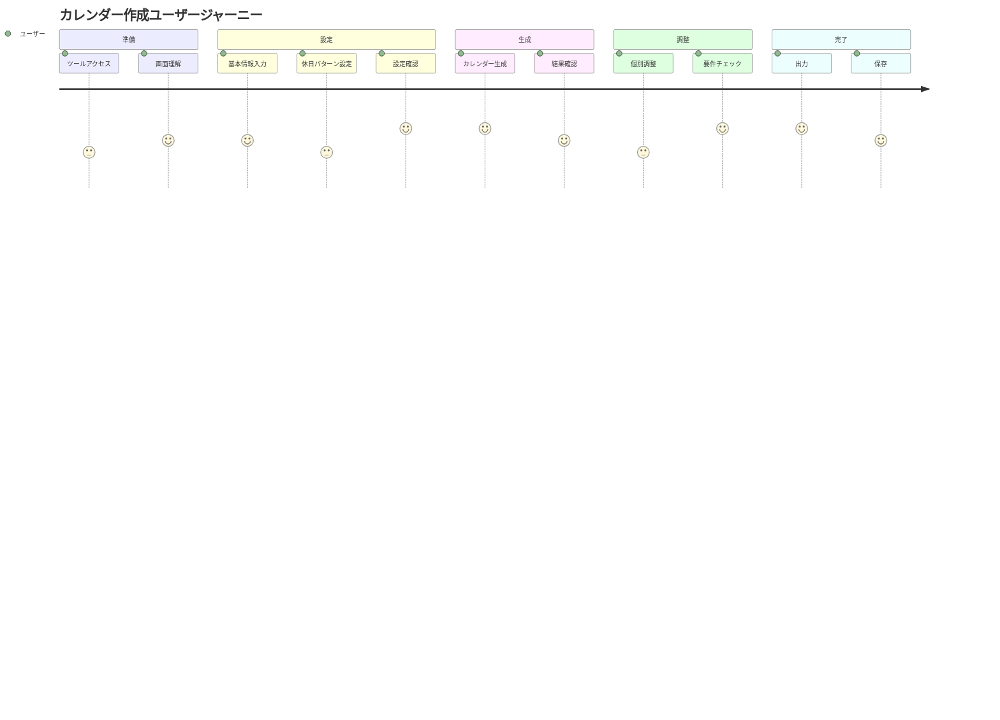
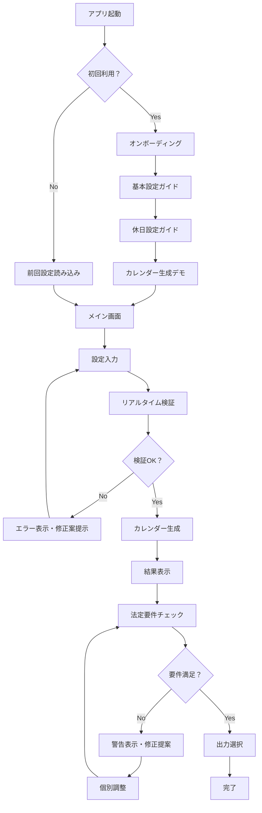

# 1年単位変形労働時間制カレンダー作成Webアプリケーション UI/UX設計書

## 目次
1. [設計コンセプト](#1-設計コンセプト)
2. [デザインシステム](#2-デザインシステム)
3. [画面レイアウト設計](#3-画面レイアウト設計)
4. [コンポーネント設計](#4-コンポーネント設計)
5. [ユーザーエクスペリエンス設計](#5-ユーザーエクスペリエンス設計)
6. [レスポンシブデザイン](#6-レスポンシブデザイン)
7. [アクセシビリティ設計](#7-アクセシビリティ設計)
8. [インタラクション設計](#8-インタラクション設計)

---

## 1. 設計コンセプト

### 1.1 デザイン哲学
**「簡潔で直感的な労務管理ツール」**

- **効率性**: 最小限のクリックで目的を達成
- **明確性**: 法的要件と現在の状態が一目で分かる
- **信頼性**: 労務管理という重要な業務に適した安心感のあるデザイン
- **プロフェッショナル**: ビジネス環境に適した洗練された外観

### 1.2 ユーザー中心設計
#### ペルソナ定義
**主要ユーザー**: 人事労務担当者（30-50代）
- 法的要件への理解が必要
- 効率的な作業を重視
- 間違いを許容できない業務特性
- IT スキルは中程度

#### ユーザージャーニー


---

## 2. デザインシステム

### 2.1 カラーパレット
```css
/* 主要カラー */
:root {
  /* プライマリ（メイン機能） */
  --primary-50: #eff6ff;
  --primary-100: #dbeafe;
  --primary-500: #3b82f6;
  --primary-600: #2563eb;
  --primary-700: #1d4ed8;

  /* セカンダリ（サブ機能） */
  --secondary-50: #f8fafc;
  --secondary-100: #f1f5f9;
  --secondary-500: #64748b;
  --secondary-600: #475569;

  /* 状態カラー */
  --success: #10b981;  /* 正常・完了 */
  --warning: #f59e0b;  /* 警告・注意 */
  --error: #ef4444;    /* エラー・違反 */
  --info: #06b6d4;     /* 情報・ヒント */

  /* カレンダー専用カラー */
  --work-day: #ffffff;       /* 労働日 */
  --rest-day: #e0f2fe;      /* 休日 */
  --holiday: #fce4ec;       /* 祝日 */
  --adjusted: #fff3e0;      /* 調整済み */
  --over-limit: #ffebee;    /* 上限超過 */

  /* テキスト */
  --text-primary: #111827;
  --text-secondary: #6b7280;
  --text-tertiary: #9ca3af;

  /* 背景 */
  --bg-primary: #ffffff;
  --bg-secondary: #f9fafb;
  --bg-tertiary: #f3f4f6;
}
```

### 2.2 タイポグラフィ
```css
/* フォントファミリー */
--font-family: 'Inter', 'Hiragino Kaku Gothic ProN', 'Hiragino Sans', Meiryo, sans-serif;

/* フォントサイズ */
--text-xs: 0.75rem;    /* 12px - 補助情報 */
--text-sm: 0.875rem;   /* 14px - 本文 */
--text-base: 1rem;     /* 16px - 基本 */
--text-lg: 1.125rem;   /* 18px - 小見出し */
--text-xl: 1.25rem;    /* 20px - 見出し */
--text-2xl: 1.5rem;    /* 24px - 大見出し */
--text-3xl: 1.875rem;  /* 30px - タイトル */

/* 行間 */
--leading-tight: 1.25;
--leading-normal: 1.5;
--leading-relaxed: 1.625;
```

### 2.3 スペーシング
```css
/* 基本単位: 4px */
--space-1: 0.25rem;  /* 4px */
--space-2: 0.5rem;   /* 8px */
--space-3: 0.75rem;  /* 12px */
--space-4: 1rem;     /* 16px */
--space-5: 1.25rem;  /* 20px */
--space-6: 1.5rem;   /* 24px */
--space-8: 2rem;     /* 32px */
--space-10: 2.5rem;  /* 40px */
--space-12: 3rem;    /* 48px */
```

### 2.4 シャドウ・ボーダー
```css
/* シャドウ */
--shadow-sm: 0 1px 2px 0 rgba(0, 0, 0, 0.05);
--shadow-md: 0 4px 6px -1px rgba(0, 0, 0, 0.1);
--shadow-lg: 0 10px 15px -3px rgba(0, 0, 0, 0.1);

/* ボーダー */
--border-width: 1px;
--border-color: #e5e7eb;
--border-radius-sm: 0.375rem;  /* 6px */
--border-radius-md: 0.5rem;    /* 8px */
--border-radius-lg: 0.75rem;   /* 12px */
```

---

## 3. 画面レイアウト設計

### 3.1 全体レイアウト
```
┌─────────────────────────────────────────────────────────────┐
│                        ヘッダー (60px)                        │
│  🏢 1年単位変形労働時間制カレンダー   [設定▼] [出力▼] [ヘルプ]   │
├─────────────────┬───────────────────────────────────────────┤
│                 │                                           │
│   設定パネル     │           メインカレンダーエリア             │
│   (320px)      │                                           │
│                 │  ┌─ 2024年 ─┐                            │
│ ┌─基本設定─┐   │  │ 4月 5月 6月... │                       │
│ │起算日    │   │  └─────────────┘                           │
│ │労働時間  │   │                                           │
│ │週開始曜日 │   │    カレンダーグリッド                        │
│ └─────────┘   │                                           │
│                 │  ┌───────────────────────────────────┐   │
│ ┌─休日設定─┐   │  │     統計・法定要件チェック結果         │   │
│ │第1週     │   │  └───────────────────────────────────┘   │
│ │第2週     │   │                                           │
│ │...       │   │                                           │
│ │祝日設定  │   │                                           │
│ └─────────┘   │                                           │
│                 │                                           │
├─────────────────┴───────────────────────────────────────────┤
│                    フッター (50px)                           │
│         [カレンダー生成] [要件チェック] [設定保存]              │
└─────────────────────────────────────────────────────────────┘
```

### 3.2 グリッドシステム
```css
.container {
  max-width: 1440px;
  margin: 0 auto;
  padding: 0 1rem;
}

.main-layout {
  display: grid;
  grid-template-columns: 320px 1fr;
  grid-template-rows: 60px 1fr 50px;
  min-height: 100vh;
  gap: 0;
}

.sidebar {
  grid-row: 2;
  border-right: 1px solid var(--border-color);
  background: var(--bg-secondary);
}

.main-content {
  grid-row: 2;
  overflow: auto;
  padding: var(--space-6);
}
```

---

## 4. コンポーネント設計

### 4.1 ヘッダーコンポーネント
```jsx
// Header.tsx
interface HeaderProps {
  title: string;
  onExport: () => void;
  onHelp: () => void;
}

const Header = ({ title, onExport, onHelp }: HeaderProps) => (
  <header className="header">
    <div className="header-content">
      <div className="header-title">
        <Icon name="building" />
        <h1>{title}</h1>
      </div>
      <nav className="header-nav">
        <DropdownMenu label="設定">
          <MenuItem>設定保存</MenuItem>
          <MenuItem>設定読込</MenuItem>
        </DropdownMenu>
        <DropdownMenu label="出力">
          <MenuItem>PDF出力</MenuItem>
          <MenuItem>Excel出力</MenuItem>
          <MenuItem>CSV出力</MenuItem>
        </DropdownMenu>
        <Button variant="ghost" onClick={onHelp}>
          ヘルプ
        </Button>
      </nav>
    </div>
  </header>
);
```

### 4.2 設定パネルコンポーネント
```jsx
// SettingsPanel.tsx
const SettingsPanel = () => (
  <aside className="settings-panel">
    <Tabs defaultValue="basic">
      <TabsList>
        <TabsTrigger value="basic">基本設定</TabsTrigger>
        <TabsTrigger value="holidays">休日設定</TabsTrigger>
        <TabsTrigger value="advanced">詳細設定</TabsTrigger>
      </TabsList>
      
      <TabsContent value="basic">
        <BasicSettingsForm />
      </TabsContent>
      
      <TabsContent value="holidays">
        <HolidaySettingsForm />
      </TabsContent>
      
      <TabsContent value="advanced">
        <AdvancedSettingsForm />
      </TabsContent>
    </Tabs>
  </aside>
);
```

### 4.3 カレンダーグリッドコンポーネント
```jsx
// CalendarGrid.tsx
interface DayCell {
  date: Date;
  workHours: number;
  isHoliday: boolean;
  isRestDay: boolean;
  isAdjusted: boolean;
  isOverLimit: boolean;
}

const CalendarGrid = ({ month, year, days }: CalendarGridProps) => (
  <div className="calendar-grid">
    <div className="calendar-header">
      <h2>{year}年{month}月</h2>
      <div className="calendar-stats">
        <Stat label="労働日数" value={workingDays} />
        <Stat label="総労働時間" value={totalHours} />
      </div>
    </div>
    
    <div className="calendar-weekdays">
      {weekdays.map(day => (
        <div key={day} className="weekday-header">{day}</div>
      ))}
    </div>
    
    <div className="calendar-days">
      {days.map(day => (
        <DayCell
          key={day.date.toISOString()}
          {...day}
          onClick={handleDayClick}
          onEdit={handleDayEdit}
        />
      ))}
    </div>
  </div>
);
```

### 4.4 日付セルコンポーネント
```jsx
// DayCell.tsx
const DayCell = ({ date, workHours, isHoliday, isRestDay, isAdjusted, isOverLimit, onClick }: DayCellProps) => {
  const cellClass = cn(
    'day-cell',
    isHoliday && 'day-cell--holiday',
    isRestDay && 'day-cell--rest',
    isAdjusted && 'day-cell--adjusted',
    isOverLimit && 'day-cell--over-limit'
  );

  return (
    <div className={cellClass} onClick={onClick}>
      <div className="day-number">{date.getDate()}</div>
      <div className="day-hours">
        {workHours > 0 ? `${workHours}h` : '休'}
      </div>
      {isOverLimit && (
        <Icon name="alert-triangle" className="warning-icon" />
      )}
    </div>
  );
};
```

### 4.5 統計パネルコンポーネント
```jsx
// StatisticsPanel.tsx
const StatisticsPanel = ({ data }: StatisticsPanelProps) => (
  <div className="statistics-panel">
    <h3>統計情報</h3>
    
    <div className="stats-grid">
      <StatCard
        title="年間労働時間"
        value={data.totalWorkHours}
        limit={2085}
        unit="時間"
        status={data.totalWorkHours > 2085 ? 'error' : 'success'}
      />
      
      <StatCard
        title="平均週労働時間"
        value={data.averageWeeklyHours}
        limit={52}
        unit="時間"
        status={data.averageWeeklyHours > 52 ? 'warning' : 'success'}
      />
      
      <StatCard
        title="労働日数"
        value={data.workingDays}
        unit="日"
      />
    </div>
    
    <LegalComplianceIndicator checks={data.legalChecks} />
  </div>
);
```

---

## 5. ユーザーエクスペリエンス設計

### 5.1 情報アーキテクチャ


### 5.2 フィードバック設計
#### 5.2.1 入力フィードバック
```jsx
// リアルタイム検証フィードバック
const InputField = ({ value, onChange, validation }: InputFieldProps) => (
  <div className="input-group">
    <label>起算日</label>
    <input
      type="date"
      value={value}
      onChange={onChange}
      className={cn('input', validation.isValid ? 'input--valid' : 'input--error')}
    />
    {validation.message && (
      <div className={cn('feedback', validation.isValid ? 'feedback--success' : 'feedback--error')}>
        <Icon name={validation.isValid ? 'check' : 'alert-circle'} />
        {validation.message}
      </div>
    )}
  </div>
);
```

#### 5.2.2 プログレス表示
```jsx
// 処理進捗表示
const ProgressIndicator = ({ steps, currentStep }: ProgressProps) => (
  <div className="progress-container">
    <div className="progress-steps">
      {steps.map((step, index) => (
        <div
          key={step.id}
          className={cn(
            'progress-step',
            index < currentStep && 'progress-step--completed',
            index === currentStep && 'progress-step--current'
          )}
        >
          <div className="step-indicator">
            {index < currentStep ? <Icon name="check" /> : index + 1}
          </div>
          <span className="step-label">{step.label}</span>
        </div>
      ))}
    </div>
  </div>
);
```

### 5.3 エラーハンドリング設計
```jsx
// 統一されたエラー表示
const ErrorBoundary = ({ children }: { children: React.ReactNode }) => (
  <div className="error-container">
    <Icon name="alert-circle" className="error-icon" />
    <h3>エラーが発生しました</h3>
    <p>設定を確認して、もう一度お試しください。</p>
    <div className="error-actions">
      <Button onClick={handleRetry}>再実行</Button>
      <Button variant="secondary" onClick={handleReset}>設定リセット</Button>
    </div>
  </div>
);
```

---

## 6. レスポンシブデザイン

### 6.1 ブレイクポイント
```css
/* ブレイクポイント定義 */
:root {
  --bp-sm: 640px;   /* タブレット縦 */
  --bp-md: 768px;   /* タブレット横 */
  --bp-lg: 1024px;  /* デスクトップ小 */
  --bp-xl: 1280px;  /* デスクトップ大 */
}
```

### 6.2 レスポンシブレイアウト
```css
/* デスクトップ (1024px以上) */
.main-layout {
  grid-template-columns: 320px 1fr;
}

/* タブレット (768px - 1023px) */
@media (max-width: 1023px) {
  .main-layout {
    grid-template-columns: 1fr;
    grid-template-rows: 60px auto 1fr 50px;
  }
  
  .sidebar {
    grid-row: 2;
    border-right: none;
    border-bottom: 1px solid var(--border-color);
  }
  
  .main-content {
    grid-row: 3;
  }
}

/* モバイル (767px以下) */
@media (max-width: 767px) {
  .sidebar {
    position: fixed;
    top: 60px;
    left: 0;
    width: 100%;
    height: calc(100vh - 110px);
    z-index: 50;
    transform: translateX(-100%);
    transition: transform 0.3s ease;
  }
  
  .sidebar--open {
    transform: translateX(0);
  }
}
```

### 6.3 タッチ操作最適化
```css
/* タッチターゲットサイズ */
.touch-target {
  min-height: 44px;
  min-width: 44px;
  padding: var(--space-3);
}

.day-cell {
  min-height: 60px;
  touch-action: manipulation;
}

/* タッチ時のフィードバック */
.day-cell:active {
  transform: scale(0.98);
  background-color: var(--primary-50);
}
```

---

## 7. アクセシビリティ設計

### 7.1 セマンティック HTML
```jsx
// 適切な見出し階層
<main role="main">
  <h1>1年単位変形労働時間制カレンダー作成</h1>
  
  <section aria-labelledby="settings-heading">
    <h2 id="settings-heading">設定</h2>
    
    <section aria-labelledby="basic-settings-heading">
      <h3 id="basic-settings-heading">基本設定</h3>
      <!-- 基本設定フォーム -->
    </section>
  </section>
  
  <section aria-labelledby="calendar-heading">
    <h2 id="calendar-heading">カレンダー</h2>
    <!-- カレンダーグリッド -->
  </section>
</main>
```

### 7.2 フォームアクセシビリティ
```jsx
// ラベルと入力欄の関連付け
<div className="form-group">
  <label htmlFor="start-date" className="form-label">
    起算日 <span aria-label="必須" className="required">*</span>
  </label>
  <input
    id="start-date"
    type="date"
    aria-describedby="start-date-help start-date-error"
    aria-required="true"
    aria-invalid={hasError}
  />
  <div id="start-date-help" className="form-help">
    変形労働時間制を開始する日を選択してください
  </div>
  {hasError && (
    <div id="start-date-error" className="form-error" role="alert">
      有効な日付を入力してください
    </div>
  )}
</div>
```

### 7.3 キーボードナビゲーション
```jsx
// カレンダーグリッドのキーボード操作
const CalendarGrid = () => {
  const handleKeyDown = (e: KeyboardEvent, date: Date) => {
    switch (e.key) {
      case 'ArrowRight':
        focusDate(addDays(date, 1));
        break;
      case 'ArrowLeft':
        focusDate(subDays(date, 1));
        break;
      case 'ArrowDown':
        focusDate(addDays(date, 7));
        break;
      case 'ArrowUp':
        focusDate(subDays(date, 7));
        break;
      case 'Enter':
      case ' ':
        editDate(date);
        break;
    }
  };

  return (
    <div
      role="grid"
      aria-label="労働時間カレンダー"
      onKeyDown={handleKeyDown}
    >
      {/* グリッド内容 */}
    </div>
  );
};
```

### 7.4 色以外の情報伝達
```jsx
// アイコンと色の組み合わせ
const StatusIndicator = ({ status, message }: StatusProps) => (
  <div className={`status status--${status}`}>
    <Icon 
      name={status === 'error' ? 'alert-circle' : 'check-circle'} 
      aria-hidden="true" 
    />
    <span className="sr-only">
      {status === 'error' ? 'エラー: ' : '正常: '}
    </span>
    {message}
  </div>
);
```

---

## 8. インタラクション設計

### 8.1 マイクロインタラクション
```css
/* ボタンのホバー・アクティブ状態 */
.button {
  transition: all 0.2s ease;
  transform: translateY(0);
}

.button:hover {
  transform: translateY(-1px);
  box-shadow: var(--shadow-md);
}

.button:active {
  transform: translateY(0);
  box-shadow: var(--shadow-sm);
}

/* 日付セルの選択アニメーション */
.day-cell {
  transition: background-color 0.15s ease, transform 0.1s ease;
}

.day-cell:hover {
  background-color: var(--primary-50);
  cursor: pointer;
}

.day-cell--selected {
  background-color: var(--primary-100);
  border: 2px solid var(--primary-500);
}
```

### 8.2 ローディング状態
```jsx
// スケルトンローディング
const CalendarSkeleton = () => (
  <div className="calendar-skeleton">
    <div className="skeleton-header">
      <div className="skeleton-title" />
      <div className="skeleton-stats">
        <div className="skeleton-stat" />
        <div className="skeleton-stat" />
      </div>
    </div>
    <div className="skeleton-grid">
      {Array.from({ length: 35 }).map((_, i) => (
        <div key={i} className="skeleton-day-cell" />
      ))}
    </div>
  </div>
);

// スムーズなローディング表示
const CalendarArea = () => {
  const { data, isLoading } = useCalendarData();
  
  return (
    <div className="calendar-area">
      <AnimatePresence mode="wait">
        {isLoading ? (
          <motion.div
            key="loading"
            initial={{ opacity: 0 }}
            animate={{ opacity: 1 }}
            exit={{ opacity: 0 }}
          >
            <CalendarSkeleton />
          </motion.div>
        ) : (
          <motion.div
            key="content"
            initial={{ opacity: 0, y: 20 }}
            animate={{ opacity: 1, y: 0 }}
            exit={{ opacity: 0 }}
          >
            <CalendarGrid data={data} />
          </motion.div>
        )}
      </AnimatePresence>
    </div>
  );
};
```

### 8.3 トランジション設計
```jsx
// ページ遷移アニメーション
const PageTransition = ({ children }: { children: React.ReactNode }) => (
  <motion.div
    initial={{ opacity: 0, x: 20 }}
    animate={{ opacity: 1, x: 0 }}
    exit={{ opacity: 0, x: -20 }}
    transition={{ duration: 0.3, ease: 'easeInOut' }}
  >
    {children}
  </motion.div>
);

// モーダルアニメーション
const Modal = ({ isOpen, onClose, children }: ModalProps) => (
  <AnimatePresence>
    {isOpen && (
      <>
        <motion.div
          className="modal-backdrop"
          initial={{ opacity: 0 }}
          animate={{ opacity: 1 }}
          exit={{ opacity: 0 }}
          onClick={onClose}
        />
        <motion.div
          className="modal-content"
          initial={{ opacity: 0, scale: 0.9, y: 20 }}
          animate={{ opacity: 1, scale: 1, y: 0 }}
          exit={{ opacity: 0, scale: 0.9, y: 20 }}
          transition={{ type: 'spring', damping: 20, stiffness: 300 }}
        >
          {children}
        </motion.div>
      </>
    )}
  </AnimatePresence>
);
```

---

## 9. モバイル最適化

### 9.1 タッチジェスチャー
```jsx
// スワイプによる月切り替え
const CalendarSwiper = () => {
  const swipeHandlers = useSwipeable({
    onSwipedLeft: () => setMonth(month + 1),
    onSwipedRight: () => setMonth(month - 1),
    trackMouse: true,
    trackTouch: true,
  });

  return (
    <div {...swipeHandlers} className="calendar-swiper">
      <CalendarGrid month={month} />
    </div>
  );
};
```

### 9.2 モバイル専用UI
```jsx
// モバイル用設定ドロワー
const MobileSettingsDrawer = ({ isOpen, onClose }: DrawerProps) => (
  <motion.div
    className="mobile-drawer"
    initial={{ x: '-100%' }}
    animate={{ x: isOpen ? 0 : '-100%' }}
    transition={{ type: 'tween', duration: 0.3 }}
  >
    <div className="drawer-header">
      <h2>設定</h2>
      <Button variant="ghost" onClick={onClose}>
        <Icon name="x" />
      </Button>
    </div>
    <div className="drawer-content">
      <SettingsForm />
    </div>
  </motion.div>
);
```

---

## 10. パフォーマンス最適化

### 10.1 仮想化
```jsx
// 大量データの仮想化表示
import { FixedSizeGrid as Grid } from 'react-window';

const VirtualizedCalendar = ({ days }: { days: DayData[] }) => (
  <Grid
    columnCount={7}
    columnWidth={80}
    height={400}
    rowCount={Math.ceil(days.length / 7)}
    rowHeight={60}
    itemData={days}
  >
    {({ columnIndex, rowIndex, style, data }) => (
      <div style={style}>
        <DayCell {...data[rowIndex * 7 + columnIndex]} />
      </div>
    )}
  </Grid>
);
```

### 10.2 遅延読み込み
```jsx
// コンポーネントの遅延読み込み
const ExportModal = lazy(() => import('./ExportModal'));
const HelpModal = lazy(() => import('./HelpModal'));

const App = () => (
  <div className="app">
    <Header />
    <MainContent />
    <Suspense fallback={<Loading />}>
      {showExportModal && <ExportModal />}
      {showHelpModal && <HelpModal />}
    </Suspense>
  </div>
);
```

---

**作成日**: 2025年6月27日  
**最終更新**: 2025年6月27日  
**バージョン**: 1.0  
**作成者**: Claude Code Assistant