# 1年単位変形労働時間制カレンダー作成Webアプリケーション 構成図・概念図・フロー図

## 目次
1. [システム全体構成図](#1-システム全体構成図)
2. [アプリケーション概念図](#2-アプリケーション概念図)
3. [画面構成図](#3-画面構成図)
4. [データフロー図](#4-データフロー図)
5. [機能フロー図](#5-機能フロー図)
6. [技術アーキテクチャ図](#6-技術アーキテクチャ図)
7. [コンポーネント構成図](#7-コンポーネント構成図)

---

## 1. システム全体構成図

---

## 2. アプリケーション概念図

---

## 3. 画面構成図

---

## 4. データフロー図

---

## 5. 機能フロー図

---

## 6. 技術アーキテクチャ図

---

## 7. コンポーネント構成図

---

## 8. 状態管理図

---

## 9. セキュリティ・プライバシー図

---

## 10. デプロイメント図

```mermaid
graph TB
    subgraph "開発環境"
        Dev["開発者PC"]
        Git["Git Repository"]
    end
    
    subgraph "CI/CD Pipeline"
        GitHub["GitHub Actions"]
        Build["Build Process"]
        Test["Test Suite"]
        Deploy["Deploy Process"]
    end
    
    subgraph "ホスティング環境"
        CDN["CDN (Vercel/Netlify)"]
        StaticFiles["静的ファイル"]
    end
    
    subgraph "ユーザー環境"
        Browser["ユーザーブラウザ"]
        Device["デバイス<br/>(PC/タブレット)"]
    end
    
    subgraph "外部サービス"
        HolidayAPI["祝日API"]
        Analytics["アナリティクス<br/>(オプション)"]
    end
    
    Dev --> Git
    Git --> GitHub
    GitHub --> Build
    Build --> Test
    Test --> Deploy
    Deploy --> CDN
    CDN --> StaticFiles
    
    Browser --> CDN
    Device --> Browser
    Browser --> HolidayAPI
    Browser --> Analytics
    
    style Dev fill:#e8f5e8
    style GitHub fill:#fff3e0
    style CDN fill:#e3f2fd
    style Browser fill:#ffcdd2
```

---

**作成日**: 2025年6月27日  
**最終更新**: 2025年6月27日  
**バージョン**: 1.0  
**作成者**: Claude Code Assistant